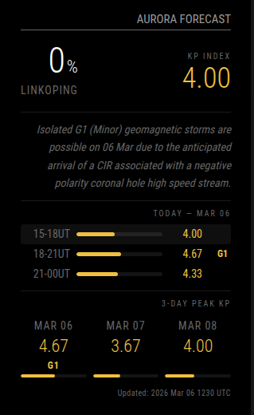
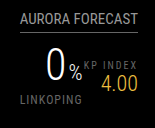

# MMM-AuroraForecast

A [MagicMirror²](https://magicmirror.builders/) module that displays **aurora viewing probability** for your location along with the **3-day Kp index forecast** from NOAA — so you never miss a geomagnetic storm.

---

## Screenshots

| Detailed | Compact |
|:---:|:---:|
|  |  |

---

## Features

- **Aurora probability %** at your exact coordinates (NOAA Ovation model)
- **Current Kp index** with colour-coded geomagnetic storm level
- **Geomagnetic storm badge** (G1–G5) when active
- **Hourly Kp breakdown** for today — past slots hidden automatically
- **3-day peak Kp summary** with visual bars
- **Two layouts**: `detailed` and `compact`

---

## Data Sources

| Data | Source |
|---|---|
| Aurora probability | [NOAA Ovation Aurora JSON](https://services.swpc.noaa.gov/json/ovation_aurora_latest.json) |
| Kp index forecast | [NOAA 3-Day Forecast](https://services.swpc.noaa.gov/text/3-day-forecast.txt) |

No API key required. Data is free and public from NOAA SWPC.

---

## Installation

```bash
cd ~/MagicMirror/modules
git clone https://github.com/damithsj/MMM-AuroraForecast
cd MMM-AuroraForecast
git checkout v1
npm install
```

Then restart MagicMirror.

---

## Configuration

Add an entry to the `modules` array in `~/MagicMirror/config/config.js`.

### Detailed layout

```js
{
  module: "MMM-AuroraForecast",
  position: "top_right",
  config: {
    updateInterval: 30,
    latitude: 58.41,
    longitude: 15.62,
    location: "Linköping",
    layout: "detailed"
  }
}
```

### Compact layout

```js
{
  module: "MMM-AuroraForecast",
  position: "top_right",
  config: {
    updateInterval: 30,
    latitude: 58.41,
    longitude: 15.62,
    location: "Linköping",
    layout: "compact"
  }
}
```

---

## Config Options

| Option | Type | Default | Description |
|---|---|---|---|
| `updateInterval` | `int` | `30` | Data refresh interval in minutes |
| `latitude` | `float` | `0` | Your location latitude |
| `longitude` | `float` | `0` | Your location longitude |
| `location` | `string` | `"My Location"` | Display label shown under the probability |
| `layout` | `string` | `"detailed"` | `"detailed"` or `"compact"` |

---

## Kp Colour Scale

| Kp | Colour | Activity |
|---|---|---|
| 0 – 2 | Blue-grey | Quiet |
| 3 – 4 | Yellow | Active |
| 5 – 6 | Orange | G1–G2 Storm |
| 7 – 9 | Red | G3–G5 Severe Storm |

> Aurora is typically visible at latitudes above 65°N at Kp 3+, and can reach 55–60°N at Kp 6+.

---

## Author

**Damith Jinasena** — [github.com/damithsj](https://github.com/damithsj)

Licensed under the [MIT License](LICENSE).
